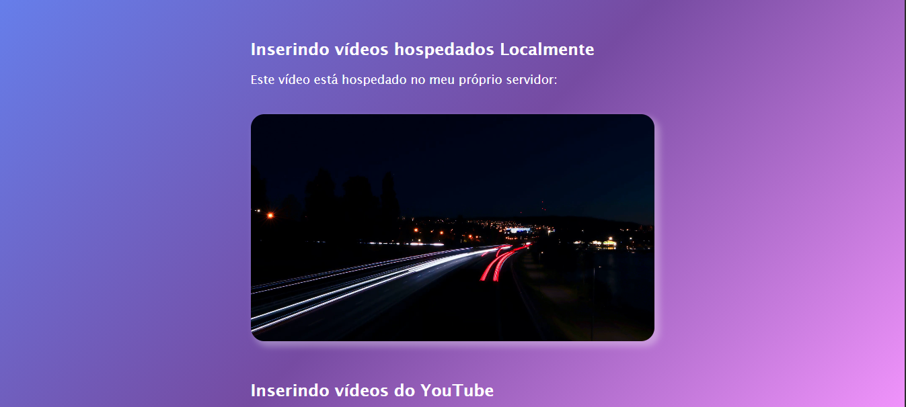

<h2 id="sobre-o-projeto">1. 🎥 Reprodutor de Vídeos Multi-formato 🎥</h2>


[](https://github.com/Domisnnet/Videos-Web-Essentials/blob/main/LICENSE)



Bem-vindo ao projeto **Exercício Vídeos**! Este repositório é um estudo prático sobre a implementação de mídias audiovisuais na web. Ele demonstra a versatilidade do HTML5 para lidar com vídeos hospedados localmente em múltiplos formatos para garantir compatibilidade, além da integração fluida de players externos como o YouTube.

---

## 📚 Tabela de Conteúdo

| 🎥 O Projeto | 🛠️ Técnico | 🤝 Comunidade |
| :---: | :---: | :---: |
| [](#sobre-o-projeto) | [](#destaques-tecnicos) | [](#codigo-fonte) |
| [](#tecnologias-utilizadas) | [](#instalacao) | [](#créditos) |
| [](#como-acessar) | [](#como-contribuir) | [](#licenca) |
| [](#funcionalidades) | [](#faq) | [](#perfil-do-github) |

---

<h2 id="tecnologias-utilizadas">2. ⚙️ Tecnologias Utilizadas</h2>

| Camada | Tecnologias | Descrição |
| :--- | :--- | :--- |
| **Estrutura** |  | Uso das tags `<video>`, `<source>` e `<iframe>`. |
| **Estilo** |  | Estilização de bordas e containers para os players. |
| **Mídia** |  | Suporte a múltiplos formatos para máxima compatibilidade. |

---

<h2 id="como-acessar">3. 🚀 Como Acessar</h2>

Clique no botão abaixo para visualizar o reprodutor de vídeos em funcionamento:

<div align="left">
  <a href="https://domisnnet.github.io/Videos-Web-Essentials/" target="_blank">
    
  </a>
</div>

---

<h2 id="funcionalidades">4. 🧩 Funcionalidades Principais</h2>

O projeto explora as melhores práticas de carregamento de mídia:

| Funcionalidade | Descrição |
| :--- | :--- |
| 📁 **Fallback de Formatos** | Uso de MP4, WebM e OGV para assegurar que o vídeo rode em qualquer browser. |
| 🖼️ **Poster Preview** | Implementação de capa personalizada antes do início do vídeo. |
| 🔄 **Autoplay & Loop** | Configuração de reprodução automática e contínua para vídeos curtos. |
| 📺 **Embed YouTube** | Integração de vídeos externos via Iframe com controles otimizados. |
| 📱 **Design Adaptável** | Utilização de classes de row e col para organização do layout. |

---

<h2 id="destaques-tecnicos">5. 💻 Destaques Técnicos</h2>

A implementação focou na robustez do player nativo:

### 📐 Compatibilidade de Navegadores
O uso da tag `<source>` encadeada permite que, se o navegador não suportar MP4, ele tente o WebM ou OGV automaticamente, evitando que o usuário fique sem o conteúdo.

### 🎥 Otimização de Iframe
Configuração de parâmetros de URL no YouTube (`autoplay`, `loop`, `controls`) para criar uma experiência de player customizada dentro do site.

---

<h2 id="instalacao">6. 🚀 Instalação e Configuração Local</h2>

Deseja analisar a estrutura de mídia ou clonar o projeto? Explore o repositório oficial:

```bash
# Clonar o repositório
git clone https://github.com/Domisnnet/Videos-Web-Essentials.git(https://github.com/Domisnnet/Videos-Web-Essentials.git)

# Acessar a pasta
cd Videos-Web-Essentials
```

---

<h2 id="como-contribuir">7. 🤝 Como Contribuir</h2>

Siga os passos abaixo para fortalecer este projeto:

| Fase | Ação | Link / Comando |
| :---: | :--- | :--- |
| **01** | **Fork** | [](https://github.com/Domisnnet/Videos-Web-Essentials/fork) |
| **02** | **Branch** | `git checkout -b feature/NovoPlayer` |
| **03** | **Commit** | `git commit -m 'feat: adição de suporte a legendas VTT'` |
| **04** | **Push** | `git push origin feature/NovoPlayer` |
| **05** | **PR** | [](https://github.com/Domisnnet/Videos-Web-Essentials/compare)

### 🐛 Encontrou um problema?
Se algo não estiver funcionando como esperado, não hesite em abrir um chamado:

[](https://github.com/Domisnnet/Videos-Web-Essentials/issues)
[](https://github.com/Domisnnet/Videos-Web-Essentials/issues/new)

---

<h2 id="faq">8. 🧠 Perguntas Frequentes</h2>

<details>
<summary><strong>Por que usar tantos formatos para o mesmo vídeo ❓</strong></summary>
<p>📁 <strong>Resposta:</strong> Cada navegador tem uma preferência de codec. Enquanto o MP4 é universal, o WebM oferece melhor compressão para navegadores como Chrome e Firefox.</p>
</details>

<details>
<summary><strong>O que é o atributo "poster" na tag video ❓</strong></summary>
<p>🖼️ <strong>Resposta:</strong> É a imagem que aparece enquanto o vídeo não é carregado ou antes do usuário dar o play, servindo como uma capa para o player.</p>
</details>

<details>
<summary><strong>Como remover os controles do YouTube ❓</strong></summary>
<p>📺 <strong>Resposta:</strong> Através do parâmetro <code>controls=0</code> na URL do src dentro do Iframe, como demonstrado no código deste projeto.</p>
</details>

---

<h2 id="codigo-fonte">9. 💻 Código Fonte</h2>

Explore a estrutura de arquivos e mídias diretamente:

[](https://domisnnet.github.io/Videos-Web-Essentials/)

---

<h2 id="créditos">10. 📝 Créditos & Reconhecimentos</h2>

O projeto de vídeos é fruto de estudos sobre multimídia na web:

| Atribuição | Responsável / Recurso | Descrição |
| :--- | :--- | :--- |
| **Dev & Arquitetura** | **DomisDev** | Implementação do layout e lógica de fallback de mídia. |
| **Conteúdo Visual** | **YouTube / Local** | Provedores de mídia para os testes de reprodução. |
| **Documentação** | **MDN Web Docs** | Referência técnica para as tags de vídeo HTML5. |
| **Apoio Técnico** | **Google Gemini** | Suporte na padronização e estruturação documental. |

### 🎯 Missão do Projeto
> "Este exercício foi desenvolvido para consolidar o conhecimento sobre a inclusão de mídias ricas na web, focando em performance e compatibilidade universal entre diferentes dispositivos e navegadores."

---

<h2 id="licenca">11. 📄 Licença</h2>

Este projeto está licenciado sob a [](https://github.com/Domisnnet/Videos-Web-Essentials/blob/main/LICENSE)

---

<h2 id="perfil-do-github">12. 👨‍💻 Perfil do GitHub</h2>

<a href="https://github.com/Domisnnet"> 
   
</a>
